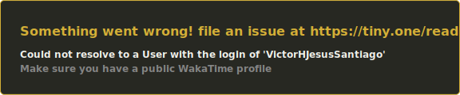
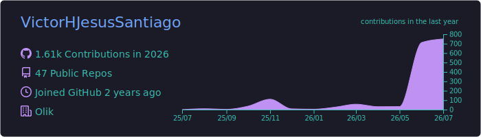
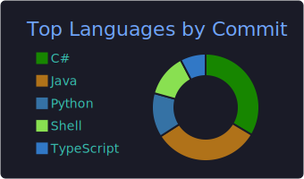
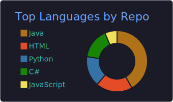

<b>🌐 🖱️ Choose Language | Escolha o Idioma | Elige el Idioma:</b>    

---

 

---

<h3>🤝 Conecte-se comigo</h3>   

> *"Porque dele e por ele, e para ele, são todas as coisas; glória, pois, a ele eternamente. Amém."* — Romanos 11:36

---

<h3>👤 Sobre Mim</h3>

Sou um **Desenvolvedor FullStack** do Brasil 🇧🇷, apaixonado por construir softwares robustos, limpos e com propósito. Sou formado em **Análise e Desenvolvimento de Sistemas (ADS)** pelo IFPR Campus Irati e estou constantemente expandindo meus conhecimentos. Minha jornada cobre o **ciclo completo de desenvolvimento de software**: desde APIs backend com Java e Spring Boot, até interfaces mobile com Flutter, passando por front-ends web e bancos de dados relacionais. Acredito que um ótimo software é construído com disciplina, profundo entendimento de arquitetura e cuidado genuíno com o usuário final.

- 🎓 **Formado em ADS** — IFPR Campus Irati
- 🌱 Aprofundando atualmente em: **NestJS**, **Prisma** & **Clean Architecture**
- 🔭 Sempre melhorando: **Java**, **Spring Boot** & **Flutter**
- 💬 Pergunte-me sobre **APIs REST**, **Arquitetura de Software** & **Design Patterns**
- ✝️ *"Tudo o que fizerem, façam de todo o coração, como para o Senhor, e não para os homens."* — Colossenses 3:23
 

---

<h3>🛠️ Tecnologias</h3>
<b>Front-end & Mobile</b> 
  
<b>Back-end</b> 
  
<b>Bancos de Dados</b> 
  
<b>Ferramentas & Plataformas</b> 
  

---

<h3>📊 Estatísticas do GitHub</h3>  

---

<h3>⏱️ Atividade no WakaTime</h3>

---

<h3>🗂️ Portfólio de Projetos</h3>

| # | Projeto | Impacto | Stack |
|:-:|:--------|:-------|:-----:|
| 🌱 | [**Workshop Spring Boot 3 & JPA**](https://github.com/VictorHJesusSantiago/workshop-springboot3-jpa) | Ciclo completo de API RESTful: entidades, repositórios, serviços e tratamento de exceções — base sólida para produção | `Java` `Spring` `H2` |
| 🛒 | [**CoopVale**](https://github.com/VictorHJesusSantiago/CoopVale) | E-commerce cooperativo com integração real de pagamento (PIX + cartões) e fluxos assíncronos via webhook | `Flask` `SQLite` `Bootstrap` |
| 🎓 | [**Estudos NestJS**](https://github.com/VictorHJesusSantiago/projeto_nest) | API para produção com auth JWT, Guards e Interceptors — explorando recursos avançados do ecossistema | `NestJS` `TypeScript` `Prisma` |
| ♿ | [**AcessoTrip**](https://github.com/VictorHJesusSantiago/AcessoTrip) | Protótipo de turismo acessível construído com WAI-ARIA — demonstrando que uma boa UX inclui a todos | `HTML` `CSS` `JS` `Mapbox` |
| 📱 | [**Flutter Counter**](https://github.com/VictorHJesusSantiago/projeto-flutter-1) | Primeiro passo no Flutter 3: ciclo de vida do StatefulWidget e gerenciamento de estado reativo | `Flutter` `Dart` |
| 🎨 | [**Doodlz**](https://github.com/VictorHJesusSantiago/doodlz) | App de desenho multi-touch com integração de acelerômetro e sistema completo de paleta de cores | `Java` `Android SDK` |
| 📸 | [**AppCamera**](https://github.com/VictorHJesusSantiago/appcamera) | Captura de mídia nativa no Android via MediaStore Intents — integração direta com capacidades do SO | `Java` `Android SDK` |
| 🛍️ | [**Lojinha Local**](https://github.com/VictorHJesusSantiago/lojinha_local) | Mini e-commerce completo: autenticação, CRUD de produtos e upload de imagens | `Flask` `SQLAlchemy` `Bcrypt` |
| ♟️ | [**Sistema de Xadrez**](https://github.com/VictorHJesusSantiago/chess_system_java) | Engine completa de xadrez no console — profundo exercício de POO com arquitetura em camadas | `Java` |
| 🗃️ | [**Demo DAO JDBC**](https://github.com/VictorHJesusSantiago/demo_dao_jdbc) | Padrão DAO clássico com CRUD completo usando JDBC puro — entendendo a persistência desde a base | `Java` `JDBC` `MySQL` |
| 🔒 | [**Cifra Híbrida**](https://github.com/VictorHJesusSantiago/programa_criptografico_chaves) | Criptografia híbrida RSA + AES com interface desktop Swing — criptografia aplicada na prática | `Java` `Swing` `JCA` |
| ♟️ | [**Exceções Java**](https://github.com/VictorHJesusSantiago/exceptios_1_java) | Sistema de reservas focado em exceções personalizadas e encadeamento — tratamento de erros robusto | `Java` |
| 🪪 | [**Validador de CPF**](https://github.com/VictorHJesusSantiago/desafio01_cpf) | Algoritmo de validação suportando entradas com e sem formatação — precisão em validação de dados | `Java` |
| 🌐 | [**Site Institucional**](https://github.com/VictorHJesusSantiago/trabalhos-do-curso) | Site responsivo com portfólio, equipe e formulário de contato — do design ao deploy | `HTML` `CSS` `JS` |

---

     
<h3>✝️ *"Tudo posso naquele que me fortalece."*</h3><b>— Filipenses 4:13</b>  
<i>Desenvolvido com ☕, fé e dedicação por <b>Victor Henrique de Jesus Santiago</b></i> <i>Sob a graça do Pai, do Filho e do Espírito Santo.</i> 

