  &nbsp;
  &nbsp;
  

    
  &nbsp;
  &nbsp;
  &nbsp;
  

---

**FullStack Developer** from Brazil 🇧🇷 — ADS Graduate at IFPR Campus Irati. I build production-ready systems end-to-end: robust Java & C# APIs, cross-platform .NET MAUI Blazor apps, computer vision, banking infrastructure, and clean web front-ends. I care about **architecture**, **craft**, and code that lasts.

> ✝️ *"Whatever you do, do it heartily, as to the Lord and not to men."* — Colossians 3:23

---

## ⚒️ Tech Stack

   
  
   
  
  &nbsp;
  &nbsp;

---

## 🗂️ Projects

<b>🏦 bank_system</b> &nbsp;   &nbsp; — Enterprise banking system with Python GUI & automated test suite

 
COBOL business logic layer + Python GUI frontend + full automated test suite. Enterprise-grade architecture from the ground up. 
<a href="https://github.com/VictorHJesusSantiago/bank_system">→ View Repository</a>

<b>👁️ Gym Execution</b> &nbsp;  &nbsp; — Fitness app with computer vision for real-time movement analysis

 
Real-time pose estimation via computer vision to analyze gym exercises and count reps — TypeScript from end to end. 
<a href="https://github.com/VictorHJesusSantiago/Gym_execution">→ View Repository</a>

<b>🧮 CompendioCalc</b> &nbsp;   &nbsp; — Cross-platform scientific calculator with .NET MAUI Blazor Hybrid

 
One C# codebase running on desktop and mobile via .NET MAUI Blazor Hybrid — scientific calculator with a clean native UI. 
<a href="https://github.com/VictorHJesusSantiago/CompendioCalc">→ View Repository</a>

<b>🔒 Hybrid Cipher</b> &nbsp;  &nbsp; — RSA + AES hybrid encryption with full Swing desktop GUI

 
RSA + AES hybrid encryption implemented in Java with a complete Swing desktop interface — applied cryptography in practice. 
<a href="https://github.com/VictorHJesusSantiago/programa_criptografico_chaves">→ View Repository</a>

<b>🌱 CoopVale</b> &nbsp;   &nbsp; — Cooperative e-commerce with real PIX + card payments & async webhooks

 
Full cooperative e-commerce platform: real PIX + card payment integration, async webhook flows, session-based auth. 
<a href="https://github.com/VictorHJesusSantiago/CoopVale">→ View Repository</a>

<b>🚀 Workshop Spring Boot 3</b> &nbsp;   &nbsp; — Production-grade RESTful API: entities, repositories, services, exception handling

 
Complete Spring Boot 3 + JPA REST API with layered architecture: entities, repositories, services, proper exception handling. 
<a href="https://github.com/VictorHJesusSantiago/workshop-springboot3-jpa">→ View Repository</a>

<b>♟️ Chess System</b> &nbsp;  &nbsp; — Complete chess engine in terminal — layered OOP, check/checkmate/stalemate

 
Full chess game in the Java terminal with move validation, check/checkmate/stalemate detection, and layered OOP architecture. 
<a href="https://github.com/VictorHJesusSantiago/chess_system_java">→ View Repository</a>

<b>♿ AcessoTrip</b> &nbsp;   &nbsp; — Accessible tourism prototype with WAI-ARIA & Mapbox routing

 
Tourism web prototype with full WAI-ARIA accessibility compliance and Mapbox route planning — great UX for everyone. 
<a href="https://github.com/VictorHJesusSantiago/AcessoTrip">→ View Repository</a>

<b>🛍️ Lojinha Local</b> &nbsp;   &nbsp; — Full-featured mini e-commerce with auth, CRUD & image upload

 
Complete mini e-commerce: user auth with Bcrypt, product CRUD, image uploads, and SQLAlchemy ORM — Flask from scratch. 
<a href="https://github.com/VictorHJesusSantiago/lojinha_local">→ View Repository</a>

<b>🗃️ Demo DAO JDBC</b> &nbsp;   &nbsp; — Classic DAO pattern with full CRUD via pure JDBC

 
DAO (Data Access Object) pattern with complete CRUD via raw JDBC — no ORM, just deep SQL and Java persistence fundamentals. 
<a href="https://github.com/VictorHJesusSantiago/demo_dao_jdbc">→ View Repository</a>

<b>🎨 Doodlz</b> &nbsp;   &nbsp; — Android multi-touch drawing app with accelerometer & color palette

 
Native Android drawing app with multi-touch canvas, accelerometer-triggered clear action, and a full color palette system. 
<a href="https://github.com/VictorHJesusSantiago/doodlz">→ View Repository</a>

<b>📸 AppCamera</b> &nbsp;   &nbsp; — Native Android camera capture via MediaStore Intents

 
Android app for native photo and video capture using MediaStore Intents — direct OS-level media integration, no libraries. 
<a href="https://github.com/VictorHJesusSantiago/appcamera">→ View Repository</a>

<b>🌐 Institutional Website</b> &nbsp;   &nbsp; — Responsive site with portfolio, team & contact form

 
Responsive institutional website with portfolio gallery, team section, and contact form — from Figma design to live deployment. 
<a href="https://github.com/VictorHJesusSantiago/trabalhos-do-curso">→ View Repository</a>

---

## 📊 GitHub Stats

  
   
   
   
   
  
    
  

---

  <b>"For of Him and through Him and to Him are all things, to whom be glory forever. Amen."</b> 
  <i>Romans 11:36</i>  
  Built with ☕ and faith · <b>Victor Henrique de Jesus Santiago</b>  
  <a href="#top">↑ back to top</a>

